# 1-Welcome
Welcome to the first Meetup for Hack The Box Meetup: Calgary, CA!
Monday, September 23, 2024 6:00 PM to 8:00 PM MDT

Opening presentation slides can be [found here](https://drive.google.com/file/d/1f_9qlvNIv0u6zQlfcMMGBMZHWtPUbztk/view?usp=sharing).
# Meetup agenda
1. Opening presentation and icebreakers (~30 minutes)
2. Hack The Box Lab walkthrough (~30 minutes)
3. Prizes? (~5 minutes - TBD by Hack The Box staff)
4. Socialization (As long as anyone would like to stay afterwards)
# Walkthrough
To help those who are new to Hack The Box, we will be walking through how to connect the the platform and how to [pwn](https://www.merriam-webster.com/dictionary/pwn) the simplest box named "Meow", which is the first machine in the Starting Point labs.
## Setting up a Virtual Machine
The recommended and most cost effective way to connect to Hack The Box is by using a Virtual Machine. If you have never heard of the term "Virtual Machine" before, think of it as a full computer and operating system that you can interact with inside of another windowed application on your computer. There is much more to understand about Virtual Machines, but that is enough of an understanding to get up and running with Hack The Box.
You may be wondering *why* we need this Virtual Machine. In our case we will be installing the Linux operating system within the virtual machine. Specifically a distribution of Linux named Kali Linux, which is designed for digital forensics, penetration testing, and ethical hacking. Kali Linux will be the operating system and toolkit we will use to play Hack The Box. Follow the steps below to install Kali Linux. Once you are finished, you may want to explore the [Linux Fundamentals]([Linux Fundamentals Course | HTB Academy (hackthebox.com)](https://academy.hackthebox.com/course/preview/linux-fundamentals))module on Hack The Box Academy if you are brand new to Linux. There are also countless resources available online to help you learn all about Linux and how to use it.
1. Visit [virutalbox.org]([Oracle VM VirtualBox](https://www.virtualbox.org/))and download the latest version of Virtual Box. This will allow you to run Virtual Machines on your computer. Follow either this [Windows Installation](https://youtu.be/8mns5yqMfZk?si=cWbudluStBmWh-Xy) or [Mac Installation](https://youtu.be/_Kz1hHT3pq4?si=jVnbTUBlx7ZO1Xuq).
2. Visit [this page]([Get Kali | Kali Linux](https://www.kali.org/get-kali/#kali-virtual-machines))to download a pre-built Kali Linux virtual machine. Make sure to pick the 64-bit Virtual Box. Follow [this video](https://youtu.be/vnX1NaF4K-Q?si=CaBKJJGIF3HaEePo)to install Kali Linux using Virtual Box.
3. After you install both Virtual Box and Kali Linux, you will be ready to play Hack The Box.
## Connect to Hack The Box (HTB) Lab Machine
Using the Kali Linux virtual machine (VM), visit https://www.hackthebox.com/ using your preferred web browser.

Navigate to HTB Labs
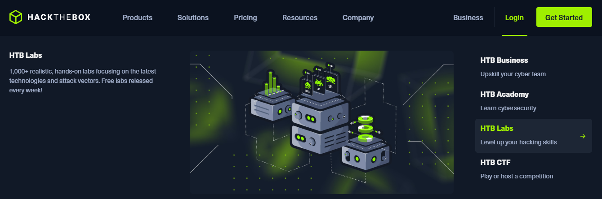
In the left side navigation, choose "Starting Point".  
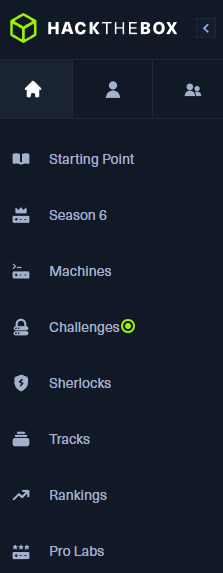

On the Starting Point landing page, you will see the machine named "Meow". This is the simplest machine on Hack The Box, and the perfect place to begin learning how to use Hack The Box Labs. In this case you can see the machine has been Pwned. By the end of this walkthrough, you will have Pwned the machine as well!
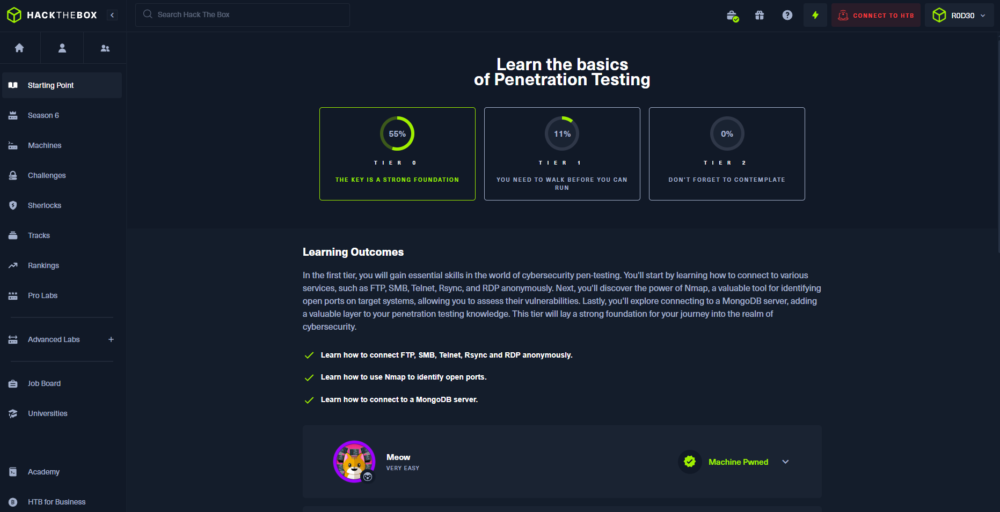
In the top right corner click "CONNECT TO HTB", and then click "Starting Point".
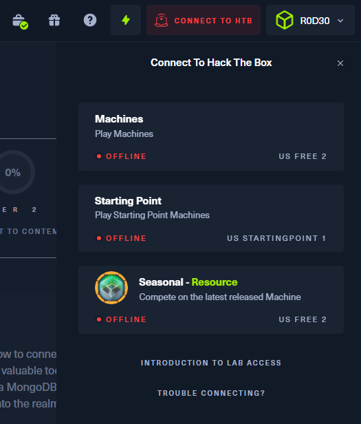
You will then be presented with the option to connect to the Starting Point server using either OpenVPN or Pwnbox. It is recommended that you choose OpenVPN if this is your first time using the platform. In the case that you are already a paid HTB VIP or VIP+ subscriber, choose Pwnbox. These subscriptions either a generous or unlimited amount of Pwnbox in-browser experience.
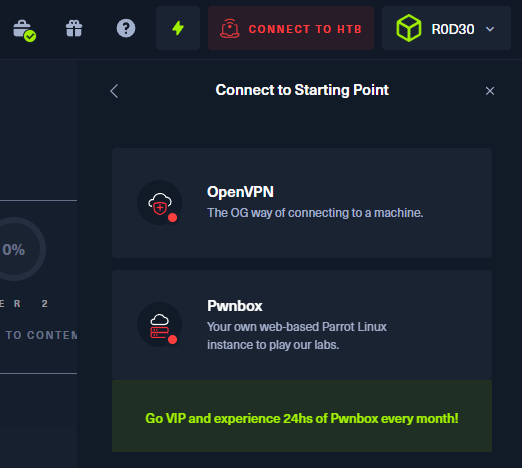
Leave the default "VPN Access" and "VPN Server" selections, and choose "TCP 443". I have found this more reliable than the UDP option for connecting. Then click "DOWNLOAD VPN" You should see an .ovpn file within your downloads folder. This file will allow us to use OpenVPN to connect to the Hack The Box server.

Open the terminal application. By default you will be in the user's root directory, otherwise known as `/home/kali/`. Type the following command to navigate to the downloads folder. `cd downloads`. `cd` stands for change directory, and it is a way to traverse the file system. Remember this command as it is one of the most commonly used.

To view all of the files in a directory, type `ls` into the terminal. The `ls` command lists all the files in the current directory. You should see a file named something like `starting_point_R0D30.ovpn`,  but instead you will see your own Hack The Box username in the filename instead of `R0D30`.

To connect to Hack The Box server enter the following command. Make sure to replace the name of the `.ovpn` file will the name of the file you downloaded. You will be asked to provide the password for kali which is also `kali`.

`sudo openvpn starting_point_R0D30.ovpn`

Let's walk through that this command does.

After the configuration script has run, you should see a line `Initialization Sequence Completed` printed out into the terminal. Refresh the Hack The Box webpage in your browser, and should "STARTING POINT" change from the colour red to green. You are now connected to a Hack The Box server and ready to hack the target machine.
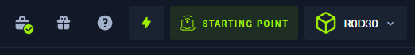
## Hacking your first box
We will begin with the simplest Lab machine in named "Meow", which has been designed specifically for beginners. Within the Hack The Box Starting Point webpage, expand the Meow machine and click the green button "SPAWN MACHINE". This will tell Hack The Box to initialize a temporary machine that we can practice our hacking skills on.
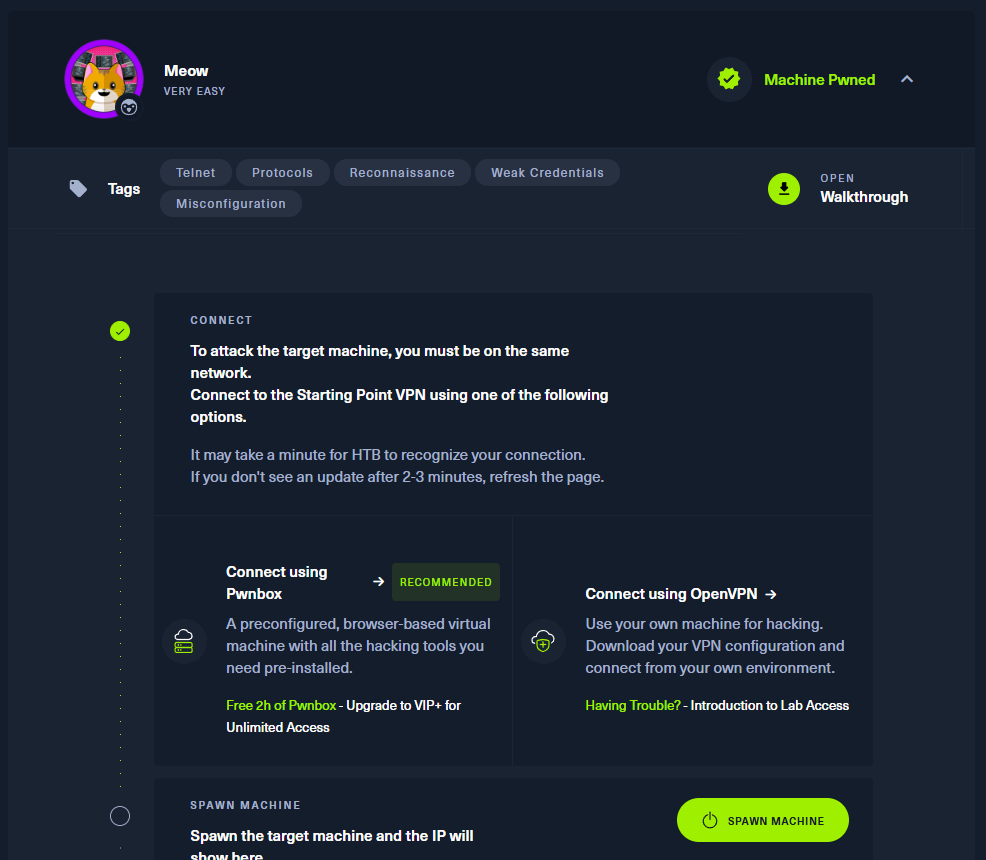

Wait for one or two minutes while Hack The Box creates the machine. If this takes longer than five minutes, try refreshing the webpage.

Once the temporary machine instance has been created, you will be provided with it's IP address. This is not a public IP address that you can visit within your web browser, but instead a network location within the Virtual Private Network (VPN) we connected to earlier using the terminal application. It is now time to evaluate and attack this target machine.
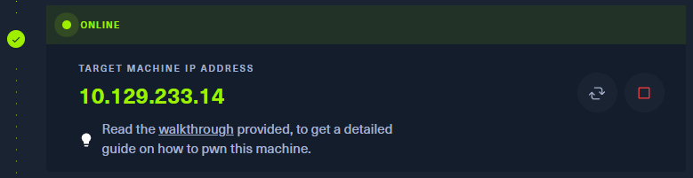
## Enumeration
Now that we have obtained the target IP address for our target, it's time to begin hacking. One of the most common first steps when approaching a box is what's known as `Enumeration`. This is the process of evaluating and documenting the current state of our target machine to learn as much as we can about it, including potential vulnerabilities.

### Nmap
To evaluate the current state of the target machine we will be using Nmap, which is a popular network scanner used to discover hosts and services by sending TCP/IP packets and analyzing the responses. Nmap allows us to detect open ports or services in a network that we can potentially exploit. Pay close attention to this next section because Nmap is one of the most used tools by penetration testers.

Because Nmap is preinstalled on Kali Linux, we can begin using it immediately. Type the following command:

`sudo nmap -sV {target IP address here from HTB platform}`

So what did we just do? Remember that `sudo` allows us to run the command as superuser, also known as "root".

`nmap` is a new command which allows us to active the application Nmap.

`-sV` is known as a flag, which are parameters we can pass to the program we are running. You can tell this is a flag parameter because of the leading dash. Flags are a very common way of passing parameters into command-line programs, so remember the concept of flags if you want to progress as a developer or hacker. In this case the `-sV` flag in Nmap stands for “service version detection.” When you use this flag, Nmap not only identifies open ports on a target system but also attempts to determine the version of the services running on those ports. It does so by sending specific probes to the services and analyzing their responses. This information can be valuable for understanding the software stack and potential vulnerabilities. Keep in mind that service version detection can be noisy and may trigger alerts on some systems, so use it only when you are not worried about triggering intrusion detection on the target system.

Finally, we pass the target IP address into Nmap so it knows what machine it should scan for open ports. Make sure to replace `{target IP address here from HTB platform}` with the IP address that was spawned in Hack The Box. Press enter and wait for Nmap to finish scanning and printing the results to the terminal window. You should see the following results:
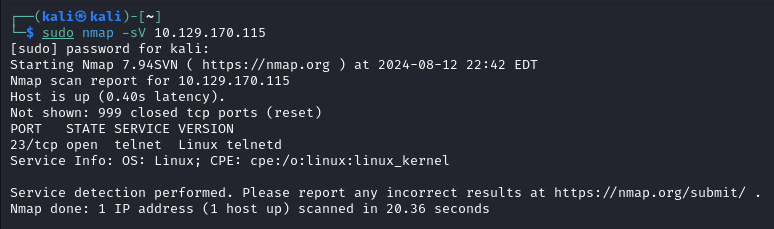
Nmap has identified that port 23/tcp is in an open state. Port 23 is the default port for Telnet, which is computer networking protocol that allows us to access remote systems over the Internet. This may be a possible vulnerability, so let's attempt to connect to this box using Telnet using the following command:

`telnet {target IP address here from HTB platform}`

You should see the following output prompting you to login:
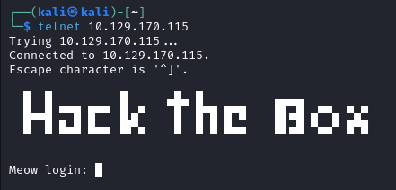

When hacking answers are not immediately obvious, and we want to try anything we can possibly think of to get into the box. One idea you might consider is a configuration mistake made by an administrator to set a password for a system. In some cases, this configuration may have been forgotten, and checking for blank passwords is a technique you may want to consider whenever you are presented with a username and password combination to guess.

Here are some common admin usernames you can attempt with a blank password.
- admin
- administrator
- root

Neither "admin" or "administrator" worked, let's try "root".

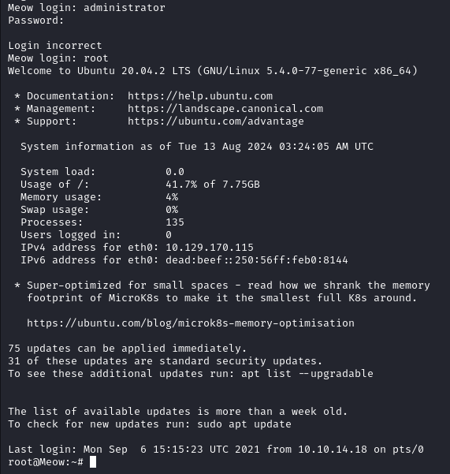

"root" worked, and we weren't even asked for a password! This is the part where you say "I'm in" using your best hacker voice.

But we aren't finished yet!